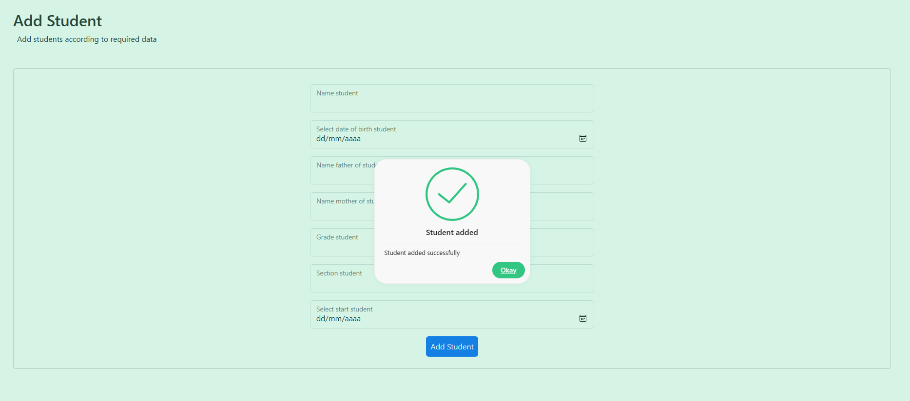

# Technical

- [Technical](#technical)
    - [Description 🚀](#description-)
    - [Prerequisitos:](#prerequisitos)
    - [Instalación 🔧](#instalación-)
      - [Backend](#backend)
      - [Frontend](#frontend)
    - [Demo 💻](#demo-)
    - [Seguridad](#seguridad)
    - [Contacto 📱](#contacto-)
    - [Licencia 📄](#licencia-)

### Description 🚀 

_Se requiere desarrollar un API con .Net, que incluya seguridad de tipo Basic Authentication o Api Key, este servicio debe de ser de tipo restful y debe de permitir insertar registros de alumnos y consultar los registros por grados, los datos que se requieren imprimir en la API son los siguientes. Para el almacenamiento de datos pueden utilizar mongoDb, PostgreSQL o MySQL._

- _Nombre del alumno_
- _Fecha de nacimiento_
- _Nombre del padre_
- _Nombre de la madre_
- _Grado_
- _Sección_
- _Fecha de ingreso_

_Desarrollar una interfaz Front-End básica en Angular o React, para CSS utilizar boostrap o similar, debe insertar y consultar los datos al API desarrollado anteriormente._

### Prerequisitos:

- [x] SO Windows 11.
- [x] Node v18.14.2+ y NPM v9.5.0+
- [x] Motor de Base de Datos PostgreSQL v16+
- [x] .NET 8 con entity framework (EF) v8.0.103+
- [x] Visual Studio 2022 v17.9.2+

### Instalación 🔧 

- Descargar o Clonar el Repositorio de manera local.
- Verificar libertad de puertos 3000 y 7121 usados para la aplicación.

#### Backend

1. Dirigirse a `backend/` y abrir la solución en Visual Studio.
2. Ubicar el archivo `appsettings.json` y cambiar la propiedad `DefaultConnection` con el usuario y password con la que instalo postgreSQL (verificar puerto y host).
3. Abrir consola en VS 2022 `Herraminetas/Administrador de paquetes NuGet/Consola del administrador de paquetes`.
4. Verificar que se este en la raiz del proyecto.
5. Ejecutar el comando `dotnet ef migrations add "database-technical01"` para crear la migración de la base de datos, si hubiese algún error verificar la instalación de DOTNET con el comando `dotnet ef --version`. Si no tiene DOTNET puede instalarlo bajo el siguiente comando `dotnet tool install --global dotnet-ef --version 8.0.1`
6. Ejecutar el comando `dotnet ef database update` para crear la base de datos.
7. Ejecutar la aplicación, se debe desplegar un swagger para verificar que funcione correctamente.

#### Frontend

1. Dirigirse a `frontend` y abrirlo en Visual Studio Code.
2. Ejecutar el comando `npm install` para instalar las dependencias.
3. Ejecutar el comando `npm start` para abrir la interfaz.

### Demo 💻 

Pagina principal de la aplicacion, se utilizo bootstrap para el diseño de la interfaz


Pantalla Students (/student) para visualizar los estudiantes activos en el sistema, en la cual se puede buscar por grado.


Se debe seleccionar el grado y buscar para visualizar los estudiantes asociados a este grado.


Resultado de busqueda de estudiantes por grado.


Para agregar un estudiante debemos irnos a la pantalla de Add Student (/add/student) y llenar los campos requeridos.


El formulario esta debidamente validado para que se respenten la integridad de los datos.


O si se ingresa algun dato incorrecto se mostrara un mensaje de advertencia.


Una vez que se ingrese un estudiante correctamente se mostrara un mensaje de confirmación.


Podemos verificar que el estudiante se ha ingresado correctamente en la pantalla de Students.


Por ultimo se puede verificar que el estudiante se ha ingresado correctamente en la base de datos.


### Seguridad

Se implemento seguridad en el backend con un AppKey, para poder acceder a los endpoints se debe enviar un token de autenticación en el header de la petición.

En .NET se implemento un middleware para validar el token de autenticación, en caso de que el token sea incorrecto o no se envie se retornara un error 401.

```csharp
    //En el archivo Startup.cs
    app.UseMiddleware<BasicAuthHandler>("RES");

    //En el archivo BasicAuthHandler.cs
    public async Task InvokeAsync(HttpContext context)
    {
        if (!context.Request.Headers.ContainsKey("Authorization"))
        {
            context.Response.StatusCode = 401;
            await context.Response.WriteAsync("Unauthorized request");
            return;
        }

        var authHeader = context.Request.Headers["Authorization"];
        var appKey = _config.GetValue<string>("AppKey");

        if (authHeader != appKey)
        {
            context.Response.StatusCode = 401;
            await context.Response.WriteAsync("Unauthorized request");
            return;
        }
        await _next(context);
    }
```
> En el appsettings.json se encuentra el AppKey que se debe enviar en el header de la petición.

Para el frontend se inyecto en el .env el AppKey para poder realizar las peticiones al backend.

```javascript
    REACT_APP_KEY=6473dbe0-e691-4a1d-ada9-af7bf12afc2c
```

ademas se implemento un interceptor para enviar el token en el header de la petición.

```javascript
    //En el archivo studentService.js
    getStudents = (grade) => {
        return axios({
            method: "GET",
            url: `${environment.servicesUrl}Student/api/get/${grade}`,
            data: null,
            headers: {
                "Content-Type": "application/json",
                "Authorization": `${environment.appKey}`
            },
            timeout: 5000
        });
    }
```

Con esto validamos que el usuario que este realizando la petición este autorizado para acceder a los recursos del backend.

Ejemplo de Autorización No Valida


Ejemplo de Autorización Valida


### Contacto 📱 

- developed by **Jefferson Geovanny Moreno Perez**<br>
- Telefono : +502 4521-7382

### Licencia 📄 

[MIT](https://choosealicense.com/licenses/mit/)
